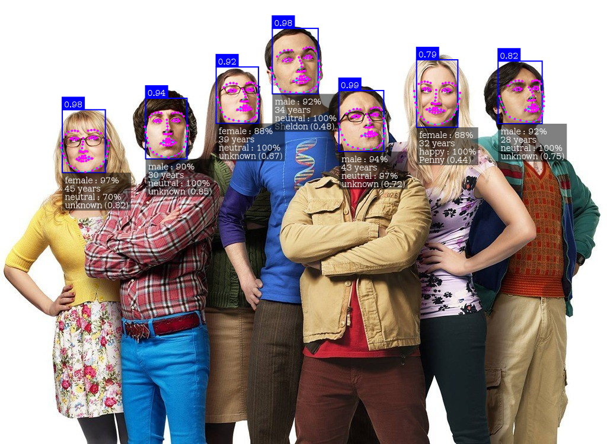

# Face-Recognition-Docker



This repo is the base of the docker hub image thebigpotatoe/face-recognition-docker. It wraps the incredible [face-api.js](#https://github.com/justadudewhohacks/face-api.js/) library using nodejs and express to deliver a flexible http server for facial recognition in a container.

This application can be run in a container directly from docker hub on multiple architectures, or the express app can be run locally if desired. Just follow the Readme for more info.

## Contents

- [Quick Start](#Quick-Start)
- [How to Use](#How-to-Use)
- [Injecting Descriptors](#Injecting-Descriptors)
- [Environmental Variables](#Environmental-Variables)
- [Endpoint Specification](#Endpoint-Specification)

For info on creating descriptors see the [documentation inside the descriptor_creator example](./descriptor_creator/README.md).

## Quick Start

```docker
docker run \
    -p 1890:1890 \
    thebigpotatoe/face-recognition-docker
```

> Note this example is to get your feet wet, it does not provide facial recognition until you follow the [inject descriptors](#Injecting-Descriptors) section

## Current Limitaions

Currently, tfjs-node does not work on the raspberry pi (or at least in the tested configurations). The app will still work but will be slow. Any suggestions on th ematter are welcome as an issue or pull request :smile:

## How To Use

> As a prerequisite for new users, read the [documentation inside the descriptor_creator example](./descriptor_creator/README.md) on how to create descriptors for facial recognition and read the [injecting descriptors section](#Injecting-Descriptors) below to get an understanding on how to use them.

This application is flexible with how it can be configured and run. Below are a few options of how to deploy this into your environment to suit your needs.

### Running Standalone Container

Running a standalone is a quick easy way of getting started with this image. There are multiple ways of passing a descriptor to a singular container described in [injecting descriptors section](#Injecting-Descriptors), but for this example we will use bind mounts.

It is assumed that you have a `descriptors.json` file stored somewhere you care about. For this example it will be in `/usr/descriptors/descriptors.json` on the host machine. Therefore you can run a bind mount using;

```docker
docker run \
    -p 1890:1890 \
    --mount type=bind,source=/usr/descriptors/descriptors.json,target=/usr/app/descriptors.json \
    --name facial-detection \
    thebigpotatoe/face-recognition-docker
```

### Running as Service

The image can also be run as a service using secrets to pass the descriptor information. This is a more production ready application example, and assumes that you have created a secret call `descriptors` which is available to your environment;

```docker
docker service create
    --name facial-recognition
    --publish published=1890,target=1890
    --secret src=descriptors,target="/usr/app/descriptors.json"
    thebigpotatoe/face-recognition-docker  
```

### Running locally

This application can also be run outside of docker on a host machine if you desire. The repo simply needs to be cloned to a known location, install the packages with `npm`, and run the main `app.js` with `nodejs`:

> Nodejs needs to be installed and available via the command line in order to run locally

```bash
$: git clone https://github.com/thebigpotatoe/face-recognition-docker.git
$: cd face-recognition-docker
$: npm i
$: node app/app.js
```

> Note that the versions of nodejs, face-api.js, and tf-js have very few working combinations. The current `package.json` has working versions of the packages which seem to work on node 10 and 15 (those were the ones tested)

## Injecting Descriptors

> Please read the [documentation inside the descriptor_creator example](./descriptor_creator/README.md) before proceeding

After building the descriptors for your application, they will then need to be passed into the container for use by the application. The application is flexible by allowing the descriptors path to be changed using environmental variables which opens up the options for using all of dockers ways of injecting files into a container.

### The descriptor location

By default the environmental variable for the location of the descriptor is the root dir of the application folder; `./descriptor.json`. This can be changed using any of dockers environmental variable commands. For example using docker's run command

```docker
docker run \
    -p 1890:1890 \
    -e DESCRIPTOR_PATH=./descriptors.json \
    --name facial-detection \
    thebigpotatoe/face-recognition-docker
```

### Using bind mounts

> This option is not recommended as it relies heavily on the host machine, however it is easy to use for testing

For testing you can use a bind mount to load your descriptors directly into the container on start. This is as easy as;

```docker
docker run \
    -p 1890:1890 \
    --mount type=bind,source="$(pwd)"/descriptor_creator/descriptors.json,target=/usr/app/descriptors.json \
    --name facial-detection \
    thebigpotatoe/face-recognition-docker
```

### Using volumes

Volumes in docker are a very convenient way to store and persist data across container restarts. The easiest way to use this application with a volume is to create a container with a volume pointing to a data location, then point the application to that location.

In order to get the descriptor there before starting the container for the first time, create a basic container and mount a volume;

```docker
docker run \
    -it
    --rm
    -v facial-data:/data \
    --name volume-copy \
    alpine
```

Then from where your descriptors are, copy them into the container with the volume using:

```docker
docker cp ./descriptor_creator/descriptors.json volume-copy:/data
```

Then start a standalone application container pointing the volume and application to the same location;

```docker
docker run \
    -p 1890:1890 \
    -e DESCRIPTOR_PATH=/data/descriptors.json \
    -v facial-data:/data
    --name facial-detection \
    thebigpotatoe/face-recognition-docker
```

### Using secrets

If you are using docker swarm it may be a good idea to use secrets. Simply use the `docker secret create [secret name] [file]` to turn the `descriptors.json` file into a secret for use with services;

```docker
docker secret create descriptors ./descriptor_creator/descriptors.json
```

Then as an example start a service using the secret;

```docker
docker service create
    --name facial-recognition
    --publish published=1890,target=1890
    --secret src=descriptors,target="/usr/app/descriptors.json"
    thebigpotatoe/face-recognition-docker  
```

### Bake them into an image

Another simple and easy way of injecting these descriptors is to build your own image and copy across the `descriptors.json` file to the root application folder manually. Just use the docker build file in the root of this repo and add the line anywhere in the file;

```docker
COPY ./descriptor_creator/descriptors.json /usr/app/descriptors.json
```

Then from the root of the repository run;

```docker
docker build -t my-new-image .
```

To use the image simply use the new tag;

```docker
docker run \
    -p 1890:1890 \
    --name facial-detection \
    my-new-image:latest
```

## Environmental Variables

This image has several modifiable environmental variables that can be changed on startup to provide a more flexible runtime. These are listed below;

| Variable          | Description                                                       | Example              |
| ------------------|:------------------------------------------------------------------| --------------------:|
| PORT              | The port for the express app to expose itself on                  |                 1890 |
| WEIGHTS_PATH      | The path to find the weights relative to `/usr/app`               |          `./weights` |
| DESCRIPTOR_PATH   | The path to find the descriptors.json file relative to `/usr/app` | `./descriptors.json` |
| MODEL_OPTIONS     | A JSON string for the model options                               |       Detailed below |
| DETECTION_OPTIONS | A JSON string for the detection options                           |       Detailed below |

### Model Options

The model options are passed to the face-api.js API to set up the model when running. These options are detailed on the face-api.js repo. For this repo there are two possible models to chose from; `ssd` or `tiny`. These come with their own options and therefore only one can be parsed at a time. An example for a possible JSON object for both are;

```json
{
    "model" : "ssd",
    "minConfidence" : 0.6,
    "maxResults" : 100
}
```

or

```json
{
    "model" : "tiny",
    "scoreThreshold" : 0.5,
    "inputSize" : 416
}
```

These objects can also be passed as an environmental variable by enclosing them with singular quotations;

`'{"model":"ssd","minConfidence":0.6,"maxResults":100}'`

### Detection Options

The detection options are used to determine what features to calculate when running the forward pass on face-api.js. Again these are detailed over at the face-api.js repo, and are available for use in the repo as detailed. Each feature is represented as an optional boolean in the object. If it is not there it is treated as false. The complete object would be;

```json 
{
    "landmarks" : true,
    "age_gender" : true,
    "expressions" : true,
    "descriptors" : true
}
```

Again, this object can be passed as an environmental string when enclosed by singular quotes;

`'{"landmarks":true,"age_gender":true,"expressions":true,"descriptors":true}'`

## Endpoint Specification

There are three endpoints exposed from the server, each provides a different service as described;

### /detect

  Simply post an image and optionally override the model parameters and detection features to detect faces and features in an image 

- __Method:__
  
    `POST`
  
- __URL Params:__

  All URL parameters are optional, however when changing the model options, the model name must be supplied to be successful.

  - __Image Params:__

    `return_img=[boolean]`

  - __Detection Options:__

    `landmarks=[boolean]`

    `expressions=[boolean]`

    `age_gender=[boolean]`

    `descriptors=[boolean]`

  - __Model Options:__

    `model=ssd|tiny`

    `minConfidence=[float] (when using ssd)`

    `maxResults=[integer] (when using ssd)`

    `scoreThreshold=[float] (when using tiny)`

    `inputSize=[integer] (when using tiny)`

- __Data Params:__

  The request expects an image posted as a file in the body of the request. It must have the name `img` to be recognised by the multer middleware.

- __Success Response:__
  
  Returns either a json structure with the desired data, or if the `return_img` parameter is passed with the request, the app will draw the desired data on the image and return that.

- __Sample Call:__

  `/detect?return_img=true&expressions=true`

### /recognise

  Post an image and optionally override the model parameters and detection features to detect faces and features and recognise faces in an image compared to supplied descriptors.

- __Method:__
  
    `POST`
  
- __URL Params:__

  All URL parameters are optional, however when changing the model options, the model name must be supplied to be successful.

  - __Image Params:__

    `return_img=[boolean]`

  - __Detection Options:__

    `landmarks=[boolean]`

    `expressions=[boolean]`

    `age_gender=[boolean]`

    `descriptors=[boolean]`

  - __Model Options:__

    `model=ssd|tiny`

    `minConfidence=[float] (when using ssd)`

    `maxResults=[integer] (when using ssd)`

    `scoreThreshold=[float] (when using tiny)`

    `inputSize=[integer] (when using tiny)`

- __Data Params:__

  The request expects an image posted as a file in the body of the request. It must have the name `img` to be recognised by the multer middleware.

- __Success Response:__
  
  Returns either a json structure with the desired data, or if the `return_img` parameter is passed with the request, the app will draw the desired data and names of faces on the image and return that.

- __Sample Call:__

  `/recognise?return_img=true&expressions=true`

### /options

  Change the default options of the application by using query params in a GET or a json object in the body of a POST.

- __Method:__
  
    `GET` | `POST`
  
- __URL Params:__

  All URL parameters are optional, however when changing the model options, the model name must be supplied to be successful.

  - __Detection Options:__

    `landmarks=[boolean]`

    `expressions=[boolean]`

    `age_gender=[boolean]`

    `descriptors=[boolean]`

  - __Model Options:__

    `model=ssd|tiny`

    `minConfidence=[float] (when using ssd)`

    `maxResults=[integer] (when using ssd)`

    `scoreThreshold=[float] (when using tiny)`

    `inputSize=[integer] (when using tiny)`

- __Data Params:__

  If the body is json, it will be parsed then used to change any valid options.

- __Success Response:__
  
  Returns the current options in JSON.

- __Sample Call:__

  `/options?expressions=true&age_gender=true`
